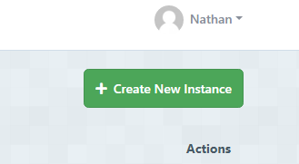
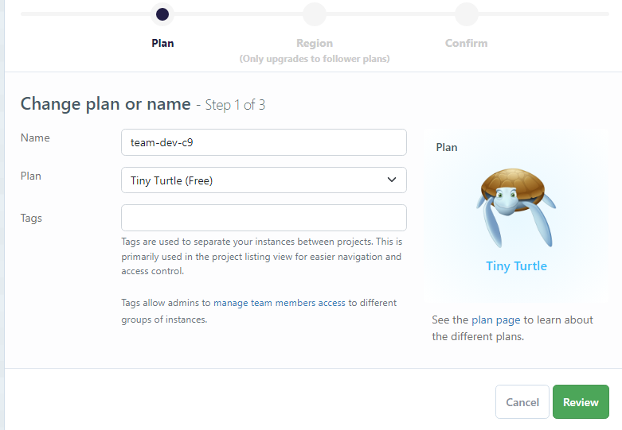
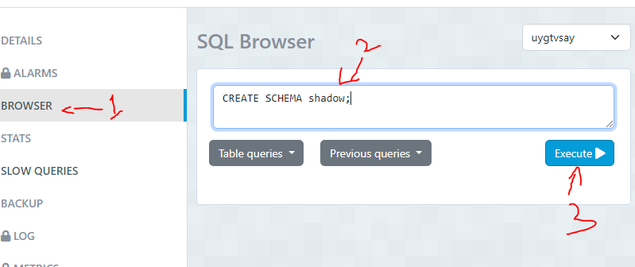

## Creating your databases with ElephantSQL

1. [Sign in to ElephantSQL](https://customer.elephantsql.com/login) using your GitHub account

   - If it asks you to create a team, create one with any name

2. When logged in, click the green _Create New Instance_ button in the top right
   

3. Enter a name for your new database instance and choose the _Tiny Turtle (Free)_ plan. **This will be your PRIMARY database**
   

4. Repeat the same steps to create a second database, this time give it the same name but add `-shadow` to the end. **This will be your SHADOW database**

5. In your shadow instance: - click the _Browser_ menu item on the left side of the screen - in the SQL Browser text input, enter `CREATE SCHEMA shadow;` - click the _Execute_ button
   

TODO - replace instructions with NEON DB
