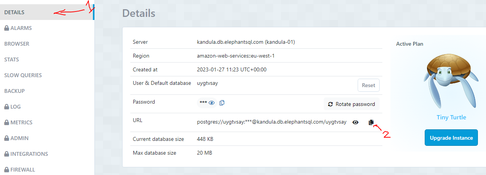

# Team Simulation - Server

## Setting up

### Pre-requisite

[Follow this guide to create your databases](./DB_SETUP.md)

Once you have complete the above guide, continue to the steps below.

1. Copy `.env.example` and name it `.env` (NOTE: Make sure to copy the file, don't remove the original)
2. Copy the URL of your **PRIMARY** database instance (see image below on how to get this) and place it into the `.env` file's `DATABASE_URL` variable, keeping `?schema=prisma` on the end. E.g. `DATABASE_URL="postgres://uy:ay@ka.db.elephantsql.com/ufy?schema=prisma"`

3. Do the same thing for your **SHADOW** database, placing its URL into the `SHADOW_DATABASE_URL` variable, keeping `?schema=shadow` on the end. E.g. `SHADOW_DATABASE_URL="postgres://jk:la@ka.db.elephantsql.com/irk?schema=shadow"`
4. `npm ci` to install dependencies
5. `npx prisma migrate reset` to build the database tables
6. `npm run dev` to run the app

## API Spec

[https://improved-journey-69de49d5.pages.github.io/](https://improved-journey-69de49d5.pages.github.io/)